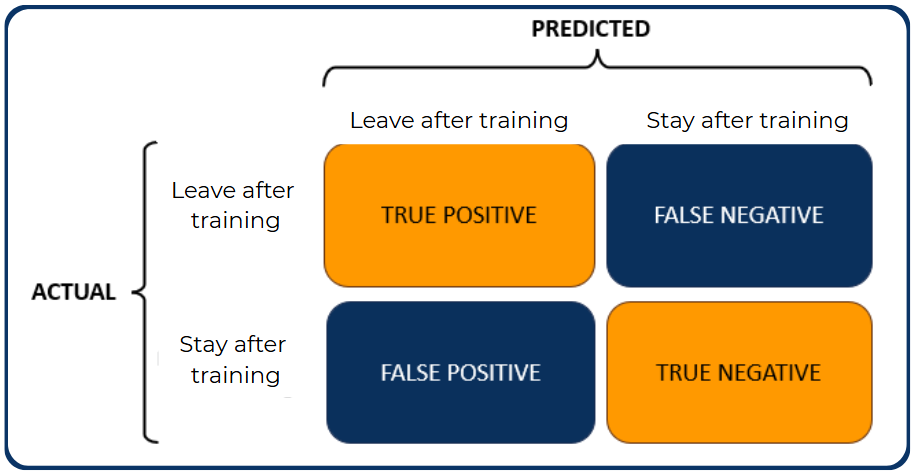

  <h1 style="font-weight: bold; display: inline-block; font-size: 44px;">
    Data-Driven Retention: Classifying the Career Intentions of Trained Data Scientists 
  </h1>

  <h3 style="background-color: #0a325e; color: white; padding: 10px 20px; margin-bottom: 20px; border-radius: 8px; font-weight: bold; font-style: italic; display: inline-block;">Final Project: Data-Driven Analysis and Supervised Learning Classification</h3>

`Disclaimer: This final project serves as the last crucial component of the educational and assessment sequence in the Job Connector Data Science and Machine Learning Programme at the Purwadhika Digital Technology School.`

**Author:** [Kerin Mulianto](https://www.linkedin.com/in/kerin-m/), [Timothy Hartanto](https://www.linkedin.com/in/timothy-hartanto/), and [Wafa Nabila](https://www.linkedin.com/in/wafanabilas/)  
**Batch:** JCDS 2704  
**Date Submitted:** `2025-04-22`  
**Data Source:** [HR Analytics: Job Change of Data Scientists](https://www.kaggle.com/datasets/arashnic/hr-analytics-job-change-of-data-scientists)  

  <h3 style="background-color: #0a325e; color: white; padding: 10px 20px; margin-bottom: 20px; border-radius: 8px; font-weight: bold; display: inline-block;">Supporting Resources</h3>

 **Github:** [Repository](https://github.com/PurwadhikaDev/BetaGroup_JC_DS_FT_JKT_27_FinalProject/tree/main)  
 **Tableau:** [Dashboard](https://public.tableau.com/views/DataScienceBootcampProfileofCandidatesWhoLeftAfterTraining/HRAnalyticsDashboardDraft13?:language=en-US&:sid=&:redirect=auth&:display_count=n&:origin=viz_share_link)  
 **Streamlit:** [Deployment](https://jcds-2704-finpro-group-beta-app-ss7ccz3xdgexjcmxzrnwd6.streamlit.app/)

 

  <h3 style="background-color: #0a325e; color: white; padding: 10px 20px; margin-bottom: 20px; border-radius: 10px; font-weight: bold;">Contoso Headquarter</h3>

    

  <h2 id="background-business-context" style="background-color: #0a325e; color: white; padding: 10px 20px; margin-bottom: 20px; border-radius: 8px; font-weight: bold; display: inline-block; font-size: 30px">Background and Business Context</h2>

**Background**

Over the past five years, global demand for data scientists has significantly outpaced supply, driven by increased reliance on big data, analytics, and artificial intelligence across diverse industries. Studies from the Royal Society highlighted that demand for data science professionals more than tripled during this period, creating an acute talent shortage worldwide.[[1]](https://royalsociety.org/news/2019/05/data-science-skills-shortages/) In response, private enterprises have increasingly turned to train-to-hire programs, recruiting candidates with non-traditional backgrounds and equipping them with specialized data science skills through structured training initiatives. Notable examples include Netflix’s Pathways bootcamp, aimed at students from historically black colleges and universities (HBCUs), and Deloitte’s Cyber tech talent academies, demonstrating the widespread adoption of these programs to close skills gaps and advance diversity goals.[[2]](https://business.edx.org/article/overcoming-5-critical-challenges-for-a-future-facing-workforce#:~:text=Netflix%20recently%20set%20out%20to,jobs%20in%20the%20tech%20industry)[[3]](https://fortune.com/education/articles/companies-are-desperate-for-cybersecurity-workers-more-than-700k-positions-need-to-be-filled/#:~:text=To%20help%20fill%20these%20high%2Ddemand%20roles%2C%20Deloitte%20Cyber%20developed%20a%20train%2Dto%2Dhire%20program%20that%20trains%20candidates%20in%20cybersecurity%20topics%20to%20fill%20jobs%20they%20wouldn%E2%80%99t%20traditionally%20be%20qualified%20for.%C2%A0)

Human Resource departments have championed these programs for their strategic benefits in talent retention, organizational agility, and cultural alignment. Internally developed talent through train-to-hire programs typically demonstrates higher levels of loyalty and lower turnover, with employees often viewing such opportunities as substantial investments in their professional development.[[4]](https://www.researchgate.net/publication/235331767_Paying_More_to_Get_Less_Specific_Skills_Incomplete_Information_and_the_Effects_of_External_Hiring_versus_Internal_Mobility) Moreover, these programs allow businesses to quickly adapt their workforce capabilities in response to changing technology and market demands, effectively creating a talent pipeline tailored to their unique organizational needs. They also enable firms to foster diversity by drawing candidates from broader talent pools, thereby enhancing innovation and culture fit within their teams.[[2]](https://business.edx.org/article/overcoming-5-critical-challenges-for-a-future-facing-workforce#:~:text=Netflix%20recently%20set%20out%20to,jobs%20in%20the%20tech%20industry)[[5]](https://www.linkedin.com/pulse/train-to-hire-t2h-compounding-75-talent-management-costs-hemlani)

From a cost perspective, train-to-hire programs often offer a more economical alternative compared to external hiring. External recruitment of experienced data scientists is costly due to high salaries, onboarding expenses, and significant turnover risks, with externally hired talent approximately $61\%$ more likely to leave within their first year compared to internally trained candidates.[[4]](https://www.researchgate.net/publication/235331767_Paying_More_to_Get_Less_Specific_Skills_Incomplete_Information_and_the_Effects_of_External_Hiring_versus_Internal_Mobility) Additionally, CareerPlug's 2024 Recruiting Metrics Report indicates that the average click-to-apply conversion rate across all industries is approximately $5\%$ with a $\$2$ Cost-per-Click (CPC).[[5]](https://www.careerplug.com/wp-content/uploads/2024/04/2024-Recruiting-Metrics-Report-1.pdf)

Conversely, train-to-hire courses (with certificate of completion) may cost up to $\$312$ per candidate [[6]](https://www.fgcu.edu/ibmskillsacademy/#AdvancedCoursesLevelIII) and reduce overall hiring costs by $1.7$ times compared to external hiring, accelerate onboarding through hands-on training, and produce talent more specifically aligned with organizational requirements.[[4]](https://www.researchgate.net/publication/235331767_Paying_More_to_Get_Less_Specific_Skills_Incomplete_Information_and_the_Effects_of_External_Hiring_versus_Internal_Mobility)[[7]](https://www.linkedin.com/pulse/train-to-hire-t2h-compounding-75-talent-management-costs-hemlani) These factors collectively underscore why enterprises increasingly prefer the train-to-hire model to address the growing global shortage of data science professionals.

**Business Context**

Contoso is a Big Data Analytics company. It has developed its own train-to-hire data science bootcamp initiatives to fill internal data scientists vacancies. Contoso fully reimburses the training cost of any candidate who has succesfully completed its data science bootcamp. Unfortunately, while many people have signed up and completed the bootcamp program, the company does not know if all of its bootcamp graduates are willing to work for Contoso as a data scientist. 

Consequently, Contoso has conducted a survey of its bootcamp graduates within one period of completing data science bootcamp to better understand its graduates' intention. The data collected from the survey include comprehensive data from each graduate, such as demographics, education level, and job experience, as well as each graduate intention of continuing with Contoso as a data scientist or leaving to gain employment elsewhere

  <h2 style="background-color: #0a325e; color: white; padding: 10px 20px; margin-bottom: 20px; border-radius: 8px; font-weight: bold; display: inline-block; font-size: 30px">Problem Statement</h2>

Since Contoso fully reimburses the cost of Contoso aims to increase the cost-effectiveness of its data science bootcamp, particularly when it comes to retaining candidates who have passed the bootcamp. 

Currently, the HR department selects candidates for specialized data science training based on subjective assessments and general qualifications, without employing a rigorous analytical approach to determine candidates' likelihood of career transition post-training. The absence of a data-driven framework leads to inefficient resource allocation, as some candidates trained in data science roles ultimately decide to switch careers, resulting in additional recruitment and training costs.

  <h2 style="background-color: #0a325e; color: white; padding: 10px 20px; margin-bottom: 20px; border-radius: 8px; font-weight: bold; display: inline-block; font-size: 30px">Goals</h2>

To address the issue, Contoso hires Beta Consulting to **develop a machine learning model that predicts the likelihood of candidates either staying with Contoso or leaving for other job opportunities after enrolling in its data science bootcamp**. 

The model will help Contoso’s HR team **to classify which candidates are most likely to seek other job opportunities after training,** enabling them to **filter out candidates** who are less likely to stay, and **minimize training and hiring sunk costs** spent on candidates who are more likely to seek employment elsewhere after completing the data science bootcamp.

  <h2 style="background-color: #0a325e; color: white; padding: 10px 20px; margin-bottom: 20px; border-radius: 8px; font-weight: bold; display: inline-block; font-size: 30px"> Stakeholder </h2>

The **Chief Human Resources Officer (CHRO)** is the key stakeholder for this initiative, as they have direct influence over HR strategy, authority over retention and recruitment decisions, control of relevant budgets, and a central role in applying predictive models for strategic workforce planning.

  <h2 id="analytics-approach" style="background-color: #0a325e; color: white; padding: 10px 20px; margin-bottom: 20px; border-radius: 8px; font-weight: bold; display: inline-block; font-size: 30px">Analytics Approach</h2>

To address the challenge of candidates retention, we will use a data-driven approach that involves both **exploratory data analysis (EDA) and machine learning based classification model.** The classification algorithms which will be implemented include Random Forest, XGBoost, Logistic Regression, etc. Eventually, after a rigorous benchmarking and fine-tuning process the chosen classification algorithm will be integrated with streamlit package for easier access.

  <h2 style="background-color: #0a325e; color: white; padding: 10px 20px; margin-bottom: 20px; border-radius: 8px; font-weight: bold; display: inline-block; font-size: 30px">Evaluation Metric</h2>

    
    

    The Confusion Matrix is an evaluation tool used in machine learning to determine the performance of a classification model.
    

  

  <table style="width: 800px; border-collapse: collapse; font-family: Arial, sans-serif; background-color: #f5f5f5; color: black; display: inline-block;">
    <thead style="background-color: #0a325e; color: white;">
      <tr>
        <th style="width: 400px; padding: 14px; border: 1px solid #ddd; text-align: center;">Target</th>
        <th style="width: 400px; padding: 14px; border: 1px solid #ddd; text-align: center;">Description</th>
      </tr>
    </thead>
    <tbody>
      <tr>
        <td style="padding: 12px; border: 1px solid #ddd; text-align: center;">0</td>
        <td style="padding: 12px; border: 1px solid #ddd; text-align: center;">Candidate will <i>stay</i> with Contoso to work as a Data Scientist</td>
      </tr>
      <tr>
        <td style="padding: 12px; border: 1px solid #ddd; text-align: center;">1</td>
        <td style="padding: 12px; border: 1px solid #ddd; text-align: center;">Candidate will <i>leave</i> Contoso to find work as a Data Scientist elsewhere</td>
      </tr>
    </tbody>
  </table>

**Type I Error (False Positive):**  
- The model incorrectly predicts that a candidate will not continue with Contoso, in reality, they would have stayed.
- *Impact:* The company wrongly excludes a loyal candidate from training, missing out on a potential data scientist. 

**Type II Error (False Negative):**  
- The model incorrectly predicts that a candidate will stay with Contoso, but they actually leave after training.
- *Impact:* The company invests in training a candidate who later leaves, leading to wasted resources and costs.

Based on the background business context, where the goal is to reduce training costs by identifying candidates who are likely to seek another job, tthe best evaluation metric should penalize False Negatives (wasting training expense on candidates who will leave) while also not neglecting False Positives (wrongly excluding candidates from training).
Therefore, we will use **F2-Score** as our evaluation metric.

**Why F2-Score?** 

$F_{2} = (1 + 2^{2}) \cdot \frac{\text{Precision} \cdot \text{Recall}}{(2^{2} \cdot \text{Precision}) + \text{Recall}}$

- The F2-score places more emphasis on recall than precision.
- Since we care more about catching candidates who will leave (True Positives) rather than wrongly excluding a few who might have stayed, recall is more important.

  <h2 style="background-color: #0a325e; color: white; padding: 10px 20px; margin-bottom: 20px; border-radius: 8px; font-weight: bold; display: inline-block; font-size: 30px">Reference</h2>

[1] [Growing demand for data science leaves Britain vulnerable to skills shortages](https://royalsociety.org/news/2019/05/data-science-skills-shortages/) 
[2] [Overcoming 5 Critical Challenges for a Future-facing Workforce](https://business.edx.org/article/overcoming-5-critical-challenges-for-a-future-facing-workforce) 
[3] [Companies are desperate for cybersecurity workers—more than 700K positions need to be filled](https://fortune.com/education/articles/companies-are-desperate-for-cybersecurity-workers-more-than-700k-positions-need-to-be-filled/) 
[4] [Paying More to Get Less: Specific Skills, Incomplete Information and the Effects of External Hiring versus Internal Mobility](https://www.researchgate.net/publication/235331767_Paying_More_to_Get_Less_Specific_Skills_Incomplete_Information_and_the_Effects_of_External_Hiring_versus_Internal_Mobility) 
[5] [CareerPlug's 2024 Recruting Metrics Report](https://www.careerplug.com/wp-content/uploads/2024/04/2024-Recruiting-Metrics-Report-1.pdf) 
[6] [IBM SkillsBuild](https://www.fgcu.edu/ibmskillsacademy/#AdvancedCoursesLevelIII) 
[7] [Train-to-Hire (T2H): Compounding 75% in Talent Management Costs](https://www.linkedin.com/pulse/train-to-hire-t2h-compounding-75-talent-management-costs-hemlani)
